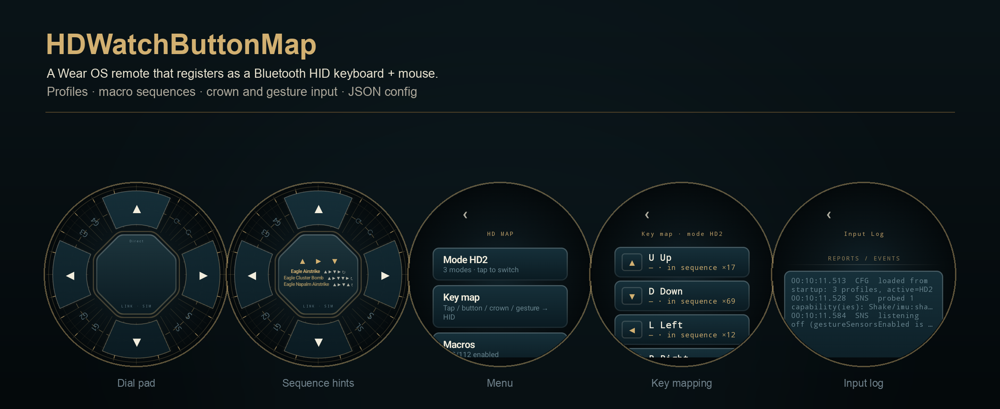
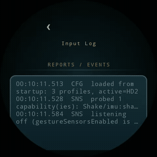

# HDWatchButtonMap



A Wear OS remote that turns a smartwatch into a programmable **Bluetooth HID
keyboard + mouse**. Two profile kinds, a dial-shaped control surface, crown and
gesture input, and a JSON config you can edit on the watch or push over adb.

Tested on Galaxy Watch6 Classic (SM-R960); minSdk 33. No host-side software, no
network permission.

## Demo



*Captured on the Wear emulator with the log-only transport (the footer reads
`LINK · SIM`); on a real watch the footer shows the Bluetooth link state.*

## What it does

- **Bluetooth HID host link** — the watch registers as a keyboard + mouse +
  consumer-control device.
- **Two profile kinds**
  - **Direct** — every mapped input fires immediately (keys, combos, mouse
    buttons, wheel, media keys).
  - **Sequence** — inputs buffer locally; a completed sequence runs a macro of
    key taps, held keys, typed text, mouse actions and delays. While you type,
    the hub lists the macros the current prefix can still reach.
- **Inputs**
  - four arc keycaps on the dial (up / down / left / right),
  - eight ring slots: crown CW, crown CCW, stem, stem-long, and four slots that
    can run any step,
  - the rotary bezel/crown, with a **per-profile detent threshold**,
  - optional sensor gestures (wrist tilt, wrist-down, IMU shake), bindable to
    slots — off by default.
- **Hold steps** — `{"hold":"CTRL"}` latches a key: first press down, next press
  up. Holds are also dropped automatically when a sequence lands, times out, or
  the pad closes, so nothing stays stuck on the host. A latch driven by the
  crown is debounced (`rotaryLatchDebounceMs`, default 700 ms) so several
  detents count as one toggle; a crown mapped to a wheel is never debounced.
- **Key jitter** — a small randomised gap between macro key steps (default
  ≤25 ms, configurable, 0 disables); perfectly even bursts read as synthetic to
  game input handlers.
- **Keep-alive foreground service** so the HID registration survives leaving the
  UI (the Bluetooth stack unregisters background apps otherwise).
- **Vibration master switch**, English + Chinese resources.

## Install

Grab `app-release.apk` from the latest release and sideload it:

```bash
adb install -r app-release.apk
```

The release APK is signed with a debug keystore — this is a personal project,
not a Play Store build.

## Build

```bash
gradle :app:assembleDebug     # debug
gradle :app:assembleRelease   # debug-signed release
```

## Configuration

- **On the watch**: menu → key map / macros / Bluetooth HID / settings.
  Profiles, rotary thresholds, gesture bindings, jitter, vibration and the
  keep-alive switch all live there.
- **From a computer**: `adb push my.json
  /sdcard/Android/data/dev.hdwatch.buttonmap/files/hdmap.json` — imported
  automatically whenever the file is newer than the last import.
- A neutral default ships with the app; the release also carries an example
  config you can import as-is.

Config sketch:

```json
{
  "version": 2,
  "settings": { "rotateThreshold": 3, "sequenceTimeoutMs": 3000, "keyJitterMs": 25,
                "rotaryLatchDebounceMs": 700 },
  "activeProfile": "macro",
  "profiles": [
    {
      "id": "macro", "name": "Macros", "kind": "MACRO",
      "rotateThreshold": 1,
      "single": {
        "CCW": { "hold": "CTRL" },
        "CW":  { "mouse": { "wheel": -1 } },
        "S":   { "click": "left" }
      },
      "macros": [
        {
          "id": "paste", "name": "Paste", "seq": "D S CW", "enabled": true,
          "steps": [
            { "keydown": "CTRL" },
            { "key": "V" },
            { "keyup": "CTRL" }
          ]
        }
      ]
    }
  ]
}
```

Steps: `key` / `keydown` / `keyup` / `combo` / `hold` / `text` / `delay` /
`mouse` / `click` / `consumer`. Sequences are written with the dial symbols
`U D L R` (the four keycaps), `CW` / `CCW` (crown), `S` / `SL` (stem) and
`G1`–`G4` (bindable slots and gestures).

## 中文说明

把手表当作蓝牙 HID 键盘/鼠标用的可编程遥控器。

- **两种模式**：直控（按下即发）与序列（本地缓冲，码对即触发一串动作；输入时中心牌会列出还能命中的宏）。
- **输入**：表盘四向弧键帽、环绕八个槽位（表冠正/反转、表冠键短/长按、四个可自定义槽）、表冠旋转（每个模式可单独设阈值）、可选手势（抬腕/腕下垂/抖动，默认关闭）。
- **锁存步骤**：`{"hold":"CTRL"}` 第一次按下按住、再按一次松开；序列触发、超时或退出盘面时自动释放。
- **按键抖动**：宏内相邻按键之间插入随机间隔（默认上限 25ms，可配置，0 关闭）。
- **保活前台服务**：退到后台也不掉 HID 注册；另有振动总开关；中英双语。
- **配置**：表上直接改，或 `adb push` 一个 JSON 到应用外部目录自动导入；release 附带示例配置。

## License

No license file yet — all rights reserved by the author unless stated
otherwise.
